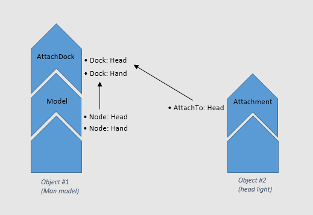

# Components
Here I list the current engine's components and their values.  
Each object in the scene consist of *objects*, *objects* themselves consist of multiple components, components also consist of multiple values.  

## Basic Components
### Transform
Alias: **transform**  
Almost all objects in the scene have this component, which defines the orientation of the object in the space.  

| Value | Type | Description
| --- | --- | --- 
| transform | Matrix | Local transformation matrix

### Bounds
Alias: **bounds**  
Defines the boundaries of the object, all renderable objects and many non-renderable objects have this component.  

| Value | Type | Description
| --- | --- | ---
| sphere | float*4 | Local bounding sphere of the object (x, y, z, radius)

### Model
Alias: **model**  
Model type objects always have this component, renders an object as a model.  

| Value | Type | Description
| --- | --- | ---
| filepath | string | (128 chars max) filepath of the model file (h3dm)
| exclude_shadows | bool | Default = false, If *true*, excludes the object from shadows (better performance)

### Light
Alias: *light*  
As the name suggests, it is used for dynamic light objects   

| Value | Type | Description
| --- | --- | ---
| type | unsigned int | Defines the light type (2=Point, 3=Spot)
| color | float*4 | Defines light color
| intensity | float | Defines light intensity (default = 1)
| atten_near | float | Defines near attenuation of light
| atten_far | float | Defines the actual light radius (far attenuation)
| atten_narrow | float | Only for spotlights, defines narrow attenuation in radians
| atten_wide | float | Only for spotlights, defines wide attenuation in radians
| lod_scheme | string | Defines LOD-scheme file for light culling, by default, engine uses */data/lod-scheme.json* for light culling scheme

### Animation
Alias: *anim*  
Loads a simple animation reel for the object and controls how to play it, mostly used in editing tools.  
Object must a valid model (with rig for skeletal animations), before applying animations. Also the animation channels should map into model's rig/hierarchy, or setting *filepath* fails.  

| Value | Type | Description
| --- | --- | ---
| filepath | string | filepath of animation reel (h3da)
| play_rate | float | Constrols the playback rate (default = 1)
| clip_name | string | Sets which clip inside the reel we want to play
| frame_idx | unsigned int | Constrols frame-by-frame playing of the reel (which frame to show)

### Camera
Alias: *camera*  
Defines object as camera.  

| Value | Type | Description
| --- | --- | ---
| type | unsigned int | Camera type, 0=Free, 1=Roll_constrained, 2=RollPitch_constrained
| fov | float | FOV of the camera (in degrees)
| near_distance | float | Near view distance
| far_distance | float | Far view distance
| max_pitch | float | Maximum pitch value (in degrees) for RollPitch_constrained camera type
| min_pitch | float | Minimum pitch value (in degrees) for RollPitch_constrained camera type
| bind_path | string | Not implemented
| active | bool | Sets camera as an active render camera in the scene

## Advanced Components
### LOD Model
Alias: **lod-model**  
Like Model component, but can load three different level-of-detail models for an object, engine automatically chooses best model detail based on distance to the camera. 

| Value | Type | Description
| --- | --- | ---
| model_high | string | (128 chars max) High detail model file (h3dm)
| model_medium | string | (128 chars max) Medium detail model file (h3dm)
| model_low | string | (128 chars max) Low detail model file (h3dm)
| scheme | string | JSON file consisting of LOD scheme information, by default, engine loads this data from */data/lod-scehem.json*
| exclude_shadows | bool | Default = false, If *true*, excludes the object from shadows

### Rigid Body
Alias: **rbody**  
Applies rigid body physics behaviour to the object. rigid body shapes are stored inside physics files (h3dp)  

| Value name | Type | Description
| --- | --- | ---
| filepath | string | (128 chars max) Physics data file (h3dp)
| kinematic | bool | If *true*, defines object is a kinematic (animated) object, kinematic objects behave like they have infinite mass, and gravity and other forces doesn't affect them
| disable_gravity | bool | Disables gravity for the object, physical object will float in space
| collision_filter | unsigned int | 32bit mask of collision filters

### AttachDock
Alias: *attachdock*  
When added to object, the object can have other objects attached to it, but before that, the object should have a valid model with extra nodes to be defined as attach docks.  

| Value | Type | Description
| --- | --- | ---
| bindto | string(32)*4 | Array of 32byte strings, that defines 4 docks for an object, each dock is the actual node name in the model

### Attachment
Alias: *attachment*  
Objects that want to attached to other objects should have this component, check out the diagram below to see the relationship between objects and attachment/attachdocks.  

| Value | Type | Descrption
| --- | --- | ---
| attachto | string | Name of the object that has *attachdock* component, and we want to attach current object to it.
| dock-slot | unsigned int | Index of the dock for target object's *attachdock* component

### Character Animation
Alias: *animchar*  
Loads both animation reel and animation controller for the object, animation controller is higher level than animation component and can be setup by *DarkMotion* tool.  
Object must a valid model (with rig for skeletal animations), before applying animations. Also the animation channels should map into model's rig/hierarchy, or setting *filepath* fails.  

| Value | Type | Description
| --- | --- | ---
| filepath | string | filepath of the animation controller (json)

